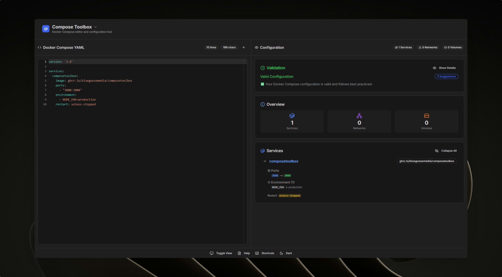

# ComposeToolbox

ComposeToolbox is a self-hostable web application that allows users to edit, validate, and get suggestions for your docker-compose.yml files. It has a fully featured code editor as well as a configuration panel that breaks down what exactly the compose file does.




## Features

- Validate your Docker-Compose files
- See a breakdown of what the compose configuration does
- Edit docker-compose.yml files
- Get suggestions for how to improve your compose files

---

## Running the Application

### Prerequisites

- Docker
- Docker Compose

### Instructions

1. Create a `docker-compose.yml` file with the following content:

```yaml
services:
  composetoolbox:
    image: ghcr.io/bluegoosemedia/composetoolbox
    ports:
      - "3000:3000"
    environment:
      - NODE_ENV=production
    restart: unless-stopped
    volumes:
      - ./composetoolbox/data:/app/data 
```

2. Run `docker-compose up -d` to start the container.

### Customizations

You can create custom quick insert templates as well as changing what the compose file is that is opened everytime you load the page.

To do these you will need to make sure you map the /app/data volume as shown in the compose.yml file. 

Then you can overwrite or modify the files within the data folder to customize your experience.

In the /data/startup folder there is a startup-template.yml file. You can put any docker compose file you want into this to be a starting point for when you load the page, or you can even just delete the contents of the file to have the editor be blank on startup.

In the /data/custom-templates folder there is a custom-templates.yml file that you can edit to add custom quick insert templates. See the example below. 

```yaml
# Custom Docker Compose Templates
# Add your own frequently used templates here
# 
# Structure:
# - name: Display name for the template
#   icon: Icon name 
#   code: The YAML code to insert 
#   description: Optional description

templates:
  - name: "Storage Pool Volume"
    icon: "HardDrive" 
    description: "Custom storage pool volume mapping"
    code: |
      volumes:
      - /mnt/Storage/composetoolbox/data:/data
  
  - name: "Dockernet"
    icon: "Network" 
    description: "Custom docker network"
    code: |
      networks:
        dockernet:
          external: true
```

Here is the full list of icons you can use in the custom templates: 
 - Code
 - Plus
 - Container
 - Database
 - Network
 - HardDrive
 - Settings
 - Globe
 - Server
 - Shield
 - Lock
 - Key
 - Mail
 - FileText
 - Cloud
 - Zap
 - Activity
 - Monitor
 - Cpu
 - MemoryStick
 - Wifi
 - Radio